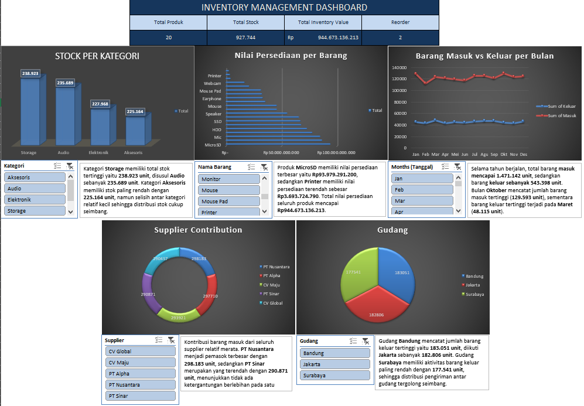

# Inventory Management Dashboard (Excel)

## Overview

This project demonstrates an Inventory Management Dashboard built entirely in Microsoft Excel using 50,000 simulated transaction records.

The dashboard provides inventory insights including stock movement, inventory valuation, supplier contribution, warehouse activity, and inventory distribution by category.

---

## Dashboard Preview

---

## Dataset

- 50,000 Inventory Transactions
- 20 Products
- 5 Suppliers
- 3 Warehouses
- Daily transactions across one year

---

## Dashboard KPIs

- Total Products
- Total Stock
- Total Inventory Value
- Reorder Items

---

## Dashboard Features

- Stock by Category
- Inventory Value by Product
- Monthly Stock In vs Stock Out
- Supplier Contribution
- Warehouse Distribution
- Interactive Slicers

---

## Excel Skills Demonstrated

- Excel Tables
- Pivot Tables
- Pivot Charts
- Slicers
- SUMIFS
- INDEX + MATCH
- IF
- COUNTIF
- Conditional Formatting
- Dashboard Design

---

## Key Findings

- Total inventory consists of **20 products** with **927,744 units** in stock.
- Total inventory value reaches **Rp944.67 billion**.
- Storage category has the highest inventory level (**238,923 units**).
- MicroSD has the highest inventory value (**Rp93.98 billion**).
- Total incoming inventory (**1,471,142 units**) exceeds outgoing inventory (**543,398 units**), indicating a healthy inventory level.

---

## Tools

- Microsoft Excel 2019
